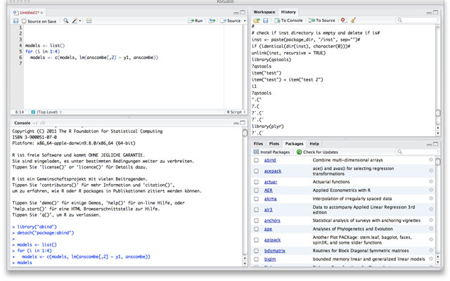

```{r echo=FALSE}
opts_chunk$set(comment=NA)
```


# R Lernen

## Was ist R?

R ist im Vergleich zu anderen verbreiteten Statistikprogrammen wie SPSS, SAS oder Stata eine relativ junge Entwicklung. Vor knapp 20 Jahren, 1992, wurde R von den Professoren *Ross Ihaka* und *Robert Gentleman* an der University of Auckland in Neuseeland, entwickelt. Heute wird die Weiterentwicklung von R von dem sogenannten *R Core Team* durchgeführt und/oder organisiert. Dies ist ein stetiger Prozess, so dass regelmäßig neue, verbesserte Versionen von R erscheinen. Die aktuelle R Version zum Zeitpunt als dieses Buch verfasst wurde war `r paste(R.Version()[['major']], R.Version()[['minor']], sep='.')`.

R ist eine *freie* und *quelloffene* Software (es ist quasi das Linux unter den Statistikprogrammen). Frei bedeutet, dass sie kostenlos heruntergeladen und benutzt werden kann. Weiterhin ist sie quelloffen (d.h. Open Source), so dass es möglich ist, die Programmierung der Software nachzuvollziehen. Der Code, der in R die Berechnungen durchführt ist nicht geheim, sondern für jedermann einsehbar. 

R unterliegt weiterhin einer sogenannten *Copy-Left Lizenz* (GPL2). Diese besagt, dass man an R Veränderungen oder Erweiterungen vornehmen kann, diese Veränderungen jedoch wieder unter derselben Lizenz bereitgestellt werden müssen. Aus diesem Grund kann R niemals zu einem kostenpflichtigen Produkt werden. Besonders für einen gesellschaftlichen Bereich der chronisch knappen Mittel, wie dem universitären Bildungswesen, ist dies ein Pluspunkt.

Neben dem R Programm selbst existieren über 3000 Erweiterungspakete für R. Diese Pakete stellen zusätzliche, spezielle Funktionalitäten für sehr viele Anwendungsbereiche bereit (ökonometrische, biogenetische, sozialwissenschaftliche etc.). Auch sie stehen i.\,d.\,R. frei und unter einer Copy-Left Lizenz zur Verfügung. Weiterhin ist es möglich, selber Erweiterungen zu programmieren und diese der Gemeinschaft zur Verfügung zu stellen. Da viele Statistikexperten rund um die Welt dies tun, wächst Anzahln an Paketen und somit die Funktionalität von R mit einer rasanten Geschwindigkeit an {fox_aspects_2009}.
    
Die freie Verfügbarkeit kombiniert mit dem zugleich immensen Funktionsumfang haben vermutlich dazu geführt, dass die Anzahl der R Nutzer und Institutionen, die R verwenden, in den letzten Jahren stark angestiegen ist. R hat es geschafft, sich seinen Platz im Kanon der anerkannten und etablierten Statistikprogramme zu erarbeiten. Viele sagen, dass es bereits zur *lingua franca* der Statistik geworden ist <z.\,B.\,>{de_leeuw_introduction_2007}. Auch an vielen deutschen Universitäten kommt R immer mehr zum Einssatz, so auch in den Sozialwissenschaften. An der Universität Bremen oder an der Freien Universität Berlin zählt R im Fach Psychologie inzwischen schon zu den Standard-Lehrinhalten. R ist inzwischen kein Programm mehr, dass nur von “Statistik-Freaks” oder einer kleinen eingeschworenen Gemeinschaft genutzt wird.
  
Anders als z.\,B. SPSS hat R keine Menüoberfläche, über die Befehle angeklickt werden können, denn R ist eine *Skript-Sprache*. Dies bedeutet, dass die Befehle, die genutzt werden, um R zu steuern, direkt als Code eingegeben werden. Dies ist den meisten Lesern wahrscheinlich bereits von der SPSS, SAS oder Stata Syntax bekannt. Weiterhin bedeutet Skript-Sprache, dass der Code von R direkt nach der Eingabe ausgeführt wird. So ist es möglich, mit R *interaktiv} zu arbeiten. Wie dies geht werden Sie z.B. in Kapitel \ref{sec:r_konsole} kennenlernen.   


## Warum R?

Dieses Buch wendet sich vor allem an Psychologen und andere Sozialwissenschaftler. Für diese stellt sich die Frage: “Ist es für mich überhaupt sinnvoll, R zu lernen?”. Es wurde bereits auf einige Vorzüge (frei, quelloffen, Funktionsumfang) von R hingewiesen. Aber sind diese Vorzüge für Sie persönlich wirklich relevant?

Ich bin kein Verfechter der Meinung, dass man auf jeden Fall R statt einem menügeführten Programm (z.\,B. SPSS) lernen sollte. Für mindestens 90\,\% aller Anwendungsfälle, denen man als Sozialwissenschaftler begegnet, ist ein Programm wie SPSS ausreichend. Es gibt jedoch Bereiche, in denen R deutlich mehr bietet als andere Programme. Dies betrifft z.B. die grafischen Möglichkeiten von R, die beeindruckend sind. Auch sind neue statistische Verfahren i.\,d.\,R. meist deutlich früher in R als in kommerziellen Programmen verfügbar. Ein weiteres wichtiges Argument ist, dass R erweiterbar ist, d.\,h. man kann selber neue Verfahren implementieren. Insgesamt sind die Möglichkeiten die R bietet immens. Dementsprechend wird die Fähigkeit, mit R umgehen zu können, in vielen Feldern einen zunehmend gefragtere Kompetenz darstellen. Speziell wenn man vor hat, sich auf Methoden, Evaluation oder artverwandte Bereiche zu spezialisieren, wird es immer mehr eine grundlegende Vorraussetzung werden, R zu beherrschen. Es hängt also ein wenig von Ihren persönlichen Zielen und Neigungen ab, ob das Erlernen von R für sie sinnvoll ist.  
Zwar ist der Aufwand, sich in R einzuarbeiten, leicht größer als bei einem menügeführten Statistikprogramm. Dieser Mehraufwand zahlt sich jedoch langfristig mehr als aus. 



Ein weiterer Vorteil der alle skriptbasierten Statistikprogramme und somit auch R betrifft ist m.E. didaktischer Natur. Es scheint mir, dass man sich durch die Nutzung von Skripten näher mit der Struktur von Daten sowie der Funktionsweise von statistischen Analysen auseinandersetzen muss. Man ist gefühlt näher dran an dem, was sonst hinter den Kulissen der Programmoberfläche passiert. Dies forciert das Verständnis von statistischen Verfahren. 

Speziell bei R kommt hinzu, dass das Programm dem Paradigma der *Sparsamkeit des Outputs* folgt. Bei Programmen wie SPSS, SAS oder Stata wird bei der Durchführung einer statistischen Analyse oftmals seitenlanger Output produziert. Dieser enthält sehr umfangreiche Informationen, die für das jeweilige Analysevorhaben jedoch u.\,U. nicht von Interesse und somit überflüssig sind. In R ist dies anders. Für R Ein- oder Umsteiger ist oftmals überraschend, dass der Output sehr kurz und übersichtlich ausfällt. Jede zusätzliche Analyse muss meist erst durch den Aufruf einer weiteren Funktion angefordert werden. Dies führt dazu, dass für dieselben Schritte im Vergleich zu anderen Statistikprogrammen mehr Befehle geschrieben werden müssen. Dieser Ansatz ist zweischneidig. Auf der einen Seite wird es leicht als unhandlich empfunden, jeden Analyseteil gesondert anfordern zu müssen. Auf der anderen Seite führt dies dazu, dass man sich als Nutzer intensiver mit den genutzten (statistischen) Verfahren auseinandersetzen muss. Denn man kann nur dann die Analysen gezielt anfordern, wenn man sich im Klaren darüber ist, welche Auswertungsoptionen überhaupt existieren und wie diese sinnvoll eingesetzt werden können. Insgesamt führt dies m.E. dazu, dass ein umfassenderes und tieferes Verständnis von der   durchgeführten Analysen entsteht.        

Einen letzten Punkt möchte ich noch betonen, da er für meinen eigenen Lernweg eine wichtige Rolle gespielt hat. Rund um R existiert eine Community - dies meint die Nutzer und Entwickler von R - die sehr aktiv ist. Die Community stellt zum einen auf vielerlei Arten Informationen bereit. Zum anderen existiert die Möglichkeit, sich  über gut organisierte Foren und Mailinglisten hilfesuchend an sie zu wenden. Diese Unterstützung habe ich beim Lernen von R als sehr wertvoll empfunden und sie hat meinen Lernweg stark erleichtert.     
 

## Wie ist es R zu lernen?

Neben den harten Fakten, warum R zu lernen sinnvoll investierte Zeit sein kann, möchte ich im Folgenden davon berichten, wie es sich für viele Sozialwissenschaftler anfühlt, R zu lernen. Ich stütze mich hierbei auf die Berichte der Studierenden aus meinen Seminaren sowie meine eigene Erfahrung. 

Besonders für Sozialwissenschaftler, die bis dato keine Programmiersprache kennengelernt haben, ist es oftmals Neuland sich mit Code-Anweisungen an den Computer zu befassen. Gefühle von Überforderung, diffusem Chaos etc. tauchen auf dem Lernweg oftmals auf. Es ist wichtig zu sehen, dass dies bei fast *allen* der Fall ist. Dies ist jedoch kein Indiz dafür, dass man dafür einfach nicht geeignet ist. Unser Gehirn braucht eben eine Weile, um für ungewohnte Vorgänge Musterbildung zu betreiben. 

R ist bekannt dafür, dass es leider eine sehr flache Lernkurve hat. Der Lernfortschritt ist zu Beginn meist recht gering und ein wenig zäh. Man wird seine Zeit brauchen, bis man sich einigermaßen sicher in dem Programm bewegen kann. Und das geht nur durch Übung. Dies ist wahrscheinlich die größte Herausforderung für den R Einsteiger. Wenn ich R Kurse gebe, schicke ich dies stets als Warnung vorweg: Durch die ersten beiden Tage des Kurses muss man einfach durch. Es ist die Anfangshürde, die zu nehmen ist, bevor es dann einfacher wird.

Als Mensch ist man jedoch nur allzu leicht dazu geneigt, den Dingen aus dem Weg zu gehen, für die man mehrere Anläufe benötigt, um sie zu bewältigen. Hierzu eine Bemerkung des Komödianten Dr. Eckhart von Hirschhausen: 

> “Nehmen Sie sich ein Beispiel an Kindern, die das Laufen lernen. Mit der Einstellung von vielen Erwachsenen hätten sie nach dem ersten Sturz aufgehört und gesagt: Nee, tut mir leid, auf zwei Beinen gehen ist nicht mein Ding.” 

Zum Lernen von R ist es vorteilhaft, sich die Haltung des Kindes zu eigen zu machen: “Klappt nicht. Na dann gleich noch einmal!”. Es wird hierbei Momente der Frustration geben: “Wie kann es denn sein, dass das jetzt nicht mehr geht? Das ging doch eben noch” etc. R oder eine beliebige andere Programmiersprache zu lernen bringt einen zu Beginn häufig in die Situation, dass der Computer einen nicht versteht. Das ist frustrierend aber unumgänglich. Wenn wir es jedoch ein wenig anders umschreiben wollten, könnten wir auch sagen: Das Lernen von R hat den positiven Nebeneffekt, dass Ihre Frustrationstoleranz erhöht wird!

Umso erlösender und voller Freude sind dann allerdings die Momente, wenn es plötzlich klappt. Obgleich dies bedeutet, dass ich als Nutzer ja lediglich ein paar Zeilen nunmehr korrekten Code geschrieben habe, fühlt es sich einfach gut an. So als ob man da gerade etwas tolles hinbekommen hat - es ist ein Stück Wirksamkeitserleben, wie bei einer Rätselaufgabe, die man schlussendlich doch noch gelöst hat.

Nach einer Zeit der Gewöhnung an R kommen die Dinge langsam ins Rollen. Es wird immer nachvollziehbarer, warum, was, wie in R gemacht wird. Die zunächst wenig sinnvoll erscheinenden Abfolgen von Befehlen werden verständlicher. Man erkennt nach und nach, dass alles einem Schema folgt und es nicht darum geht, Befehle auswendig zu lernen. Ein typischer Satz, der dann zu hören ist, ist folgender: “Das hat ja eine Logik. Das ist ja wie eine Sprache!” Wenn man diese Einsicht erstmal hat, dann ist man schon ein gutes Stück vorangekommen. An diesem Punkt, an dem man beginnt, Strukturen zu erkennen, fangen die Dinge einfacher zu werden und die Vorteile einer Skriptsprache treten immer deutlicher zu Tage. 

Nachfolgender Ausschnitt aus der Hausarbeit einer Kursteilnehmerin verdeutlicht sehr schön, wie das Lernen von R ablaufen kann.

> “Am Ende dieser Hausarbeit möchte ich noch einmal kurz auf die Verwendung von R als Tool zur statistischen Datenanalyse eingehen. Als ich mit der Arbeit begann, fiel es mir zunächst recht schwer, mich auf das Programm einzustellen und die nötige Konzentration und Ausdauer aufzubringen, die nötig ist, um sinnvoll mit dem Programm arbeiten zu können. Besonders bei Aufgabe 2 war ich an mancher Stelle kurz vor dem Aufgeben, da ich den richtigen Code scheinbar nicht zustande bringen konnte.  
>   
> Aufgabe 3 hingegen weckte ein wenig den Spieltrieb, so dass es Spaß machte, die versteckten Aussagen in den Daten aufzuspüren. Bei einer Aufgabe dieser Art machte dann auch die Verwendung von R Spaß, da man viel dichter an der Syntax arbeitet als bei anderen Programmen wie SPSS. Auf eine gewisse Weise ist man dadurch besser mit den Daten und Analysen verbunden, so war zumindest mein Gefühl.  
> 
> Abschließend lässt sich sagen, dass R insbesondere im grafischen Bereich tolle Möglichkeiten bietet, die es definitiv kennenzulernen lohnt. Zudem erhält man ein besseres Verständnis von Syntax und Daten, dass einem bei der Verwendung eines Klickmenüs verborgen bleibt. Daher würde ich persönlich in jedem Fall empfehlen, R als Standardprogramm in die psychologische Methodenlehre aufzunehmen und es so viel stärker bekannt zu machen.” 
> 
> (Studentin, Bachelor Psychologie)

Schließen wir sozial erwünschtes Antwortverhalten hier einmal aus, 
so scheinen Psychologiestudenten den Umgang mit R trotz anfänglicher Schwierigkeiten als Bereicherung zu empfinden und dessen Vorteile zu schätzen.


## R ist eine Sprache
 
Mehrmals wurde bisher darauf verwiesen, dass R eine *Sprache* ist - eine Programmiersprache. Dass in dem Begriff *Programmiersprache* das Wort *Sprache* enthalten ist, verweist auf grundlegende Gemeinsamkeiten zwischen beiden. Führen wir uns einmal vor Augen, was dies für das Lernen von R bedeutet, indem wir uns fragen, wie das Lernen einer Sprache äußerlich betrachtet in etwa abläuft. 

Häufig beginnt das Lernen einer Sprache damit, dass man einzelne Worte und ihre Bedeutung kennenlernt. Hierzu legt man sich in der Regel ein Vokabelheft an. Es folgen die grundlegenden grammatikalischen Regeln. Diese legen fest, wie man Wörter zu Aussagen verknüpfen kann. Nach einiger Zeit ist man in der Lage einen Satz, dann viele Sätze und später ganze Sinnzusammenhänge zu formulieren. Das Lernen einer Programmiersprache ist im Prinzip ähnlich: Man lernt zunächst die Funktionen und Datentypen (Wörter) und die Syntax (Grammatik) und kann schließlich Aussagen bzw. Anweisungen an den Computer formulieren. 

Ein Unterschied besteht allerdings darin, dass menschliche Sprache große Unschärfe und auch ein gewisses Maß an Fehlern zulässt, ohne unverständlich zu werden. So z.\,B. der Satz “Wo ist Auto?”. Jeder Hörer kann diesen Satz verstehen, jedoch klingt er seltsam und ist grammatikalisch falsch. Im Gegensatz zu einem Menschen ist das R Programm jedoch nicht fähig, zu verstehen was ich meine, wenn meine Äußerung nicht *exakt* ist. R ist wie ein strenger Sprachlehrer, der einen falschen Satz schlichtweg mit einem unverständlichen Schulterzucken abtut und einen bittet, es noch einmal richtig zu formulieren, ohne einen dabei jedoch zu verbessern. 

Für das Erlernen der Worte (bzw. Funktionen) steht in R das Pendant zu einem Wörterbuch zur Verfügung (das R-Hilfesystem, siehe Kap. \ref{sec:help_system}). Die Grammatik muss jedoch darüber hinaus verinnerlicht werden, denn das Einhalten der syntaktischen (grammatikalischen) Regeln von R ist zentral. So haben Punkt, Komma, Semikolon innerhalb einer Anweisung eine bestimmte Bedeutung und auch ihren festen Platz. Dieser muss zunächst gelernt werden. Auch die deutsche Sprache kennt hier (klare) grammatikalische Regeln, wo z.\,B. ein Komma gesetzt wird. Mitunter ist dieses für die Bedeutung des Satzes zentral:

>  Jeder denkt an sich selbst zuletzt.
>
>  Jeder denkt an sich, selbst zuletzt.

Obgleich die beiden Sätze exakt dieselben Worte in derselben Reihenfolge enthalten, bedeuten sie grob das Gegenteil voneinander. Dies wurde allein durch das Setzen eines einzelnen Kommas bewirkt! Ohne Frage ist dies in der deutschen Sprache eher eine Ausnahme. In den meisten Fällen unterstützt ein Komma nur dabei, den Satz zu strukturieren. Wir können viele Sätze meist problemlos ohne ein Komma richtig verstehen. Anders verhält es ich bei dem wichtigsten Interpunktionszeichen, dem Punkt. Das Weglassen eines Punktes erschwert bestenfalls das Verständnis, schlimmstenfalls macht es ein Verstehen unmöglich. Kurzum, grammatikalische Regeln und besonders die Interpunktionen haben in der Schriftsprache eine zentrale Funktion, um uns das Verstehen zu ermöglichen.

Übertragen auf R heißt dies, dass die Syntax (Grammatik) exakt eingehalten werden muss, um auch das Richtige auszudrücken. Da R keine Möglichkeit hat, das Gemeinte anderweitig zu erschließen, muss es exakt formuliert werden. Ein Nicht-Einhalten der syntaktischen Regeln wird dann auch sofort zu einem Fehler führen. Grammatikalische Fehler, die im Rahmen einer Programmiersprache *Syntaxfehler* genannt werden, sind der häufigsten Fehler von R Einsteigern. Es lohnt sich definitiv, immer wieder zu prüfen, ob die Klammern, Punkte etc. wirklich an der richtigen Stelle gesetzt wurden. 

Das Gute an der R Syntax ist, dass sie klaren Regeln folgt. R verdient in diesem Sinne als *Sprache* bezeichnet zu werden. Hier unterscheidet sie sich m.~E. stark von der Syntax manch anderer gängiger Statistikprogramme. Wenngleich es in diesen Programmen auch möglich ist, Anweisungen schriftlich zu formulieren, stellt sich nur sehr schwer das Gefühl ein, dass man bei Grundkenntnissen der Syntax, beliebige andere Anweisungen formulieren könnte. Es wird weniger deutlich, auf welchen allgemeinen Regeln die Ausdrücke beruhen.


## Das Arbeiten mit R

Wenn man R zum ersten Mal startet mag es sein, dass man ein wenig enttäuscht ist. Denn R mit seinem mächtigen Funktionsumfang zeigt beim Einschalten nicht mehr als ein (fast) leeres Fenster, das mit Code-Anweisungen gefüllt werden will. Wie wir eben gesehen haben, müssen die Anweisungen und die Syntax zunächst gelernt werden. Dies bedingt, dass das Arbeiten mit R anders abläuft als z.\,B. mit SPSS.

Das Arbeiten mit SPSS erfolgt zumeist mit Hilfe der graphischen Oberfläche. Man kann sich durch Menüs und Untermenüs klicken. Dabei bekommt man einen Überblick, was für Verfahren die Software bereitstellt und welche Einstellmöglichkeiten man dabei hat. Da ein derartiges Menü in R nicht existiert, müssen diese Informationen anderweitig bereitgestellt werden. Dies geschieht in Form von schriftlicher, standardisierter *Dokumentation*, allerdings ausschließlich auf Englisch. Alle Funktionen, die man in R nutzen kann (Regression, Faktorenanalyse etc.) verfügen über eine zugehörige Dokumentation. Dies ist notwendig, da es schlichtweg unmöglich ist, die Gesamtheit der Funktionen und Befehle im Kopf zu behalten. Alle verfügbaren  Einstellungsmöglichkeiten, die eine Funktion oder ein Verfahren bieten - wie z. B. die Anzahl der zu extrahierenden Faktoren bei der Faktorenanalyse - können dieser Dokumentation entnommen und darin nachgelesen werden.

Folglich bedeutet dies für das Arbeiten mit R, dass man anstatt durch ein graphisches Auswahlmenü zu klicken, stets die Dokumentation lesen *muss*, um zu verstehen, wie einzelne Funktionen bedient werden. Wer bereits über Erfahrung mit einer Programmiersprache verfügt, der weiß, dass Programmieren *immer* bedeutet, viel Dokumentation zu lesen. Dies bedarf zunächst einer gewissen Gewöhnung wird aber schnell zur Selbstverständlichkeit. Ohne die Dokumentation wäre man schlichtweg verloren. Aus diesem Grund ist das Hilfesystem von R, dass im folgenden Kapitel vorgestellt wird, von zentraler Bedeutung. Abbildung \ref{fig:working_with_r} ist eine schöne Metapher für das Arbeiten mit R und die Wichtigkeit von Dokumentation.

```{r}
summary(lm(y1 ~x1, anscombe))
```


